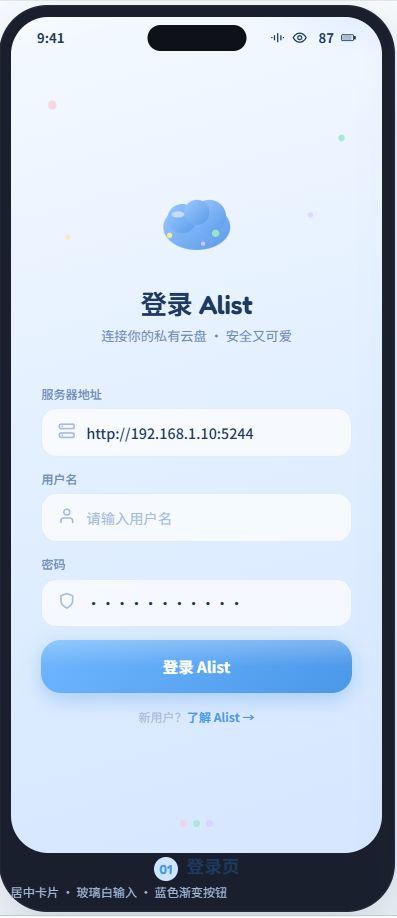
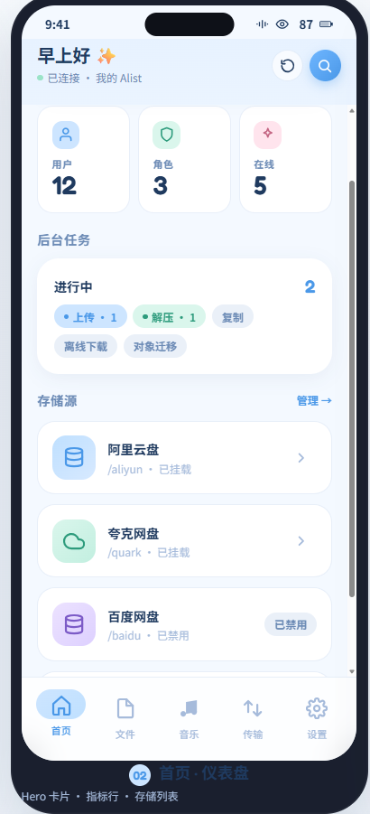
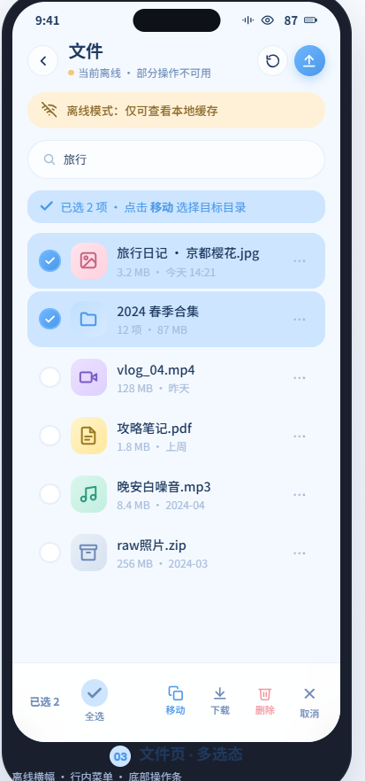
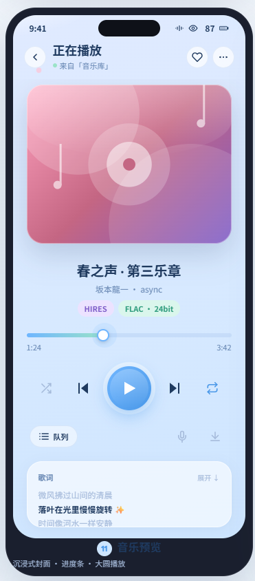

# Alist Android Client

一款面向 [Alist v3](https://github.com/AlistGo/alist) 的原生 Android 文件管理客户端。
单 Activity、Jetpack Compose + Material 3、MVVM + Repository 架构；不依赖 WebView 包装，也不复刻 Alist 管理后台。

> 包名 `com.textvision.alistclient` · 当前版本 `0.1.0` (`versionCode = 2`)

---

## 功能概览

| 模块 | 能力 |
| --- | --- |
| 登录与会话 | 服务器地址 + 用户名 + 密码登录；token 失效自动重登；密码 EncryptedSharedPreferences 加密落盘 |
| 首页仪表盘 | 服务器概览（用户数 / 角色数 / 在线人数 / 后台任务数）；存储源快捷入口；下拉刷新 |
| 文件浏览 | 目录树、面包屑、排序、实时搜索、多选；新建 / 重命名 / 删除 / 复制 / 移动（服务端 API，不经本机中转） |
| 上传 / 下载 | 并发限流（上传 2、下载 3）；Room 持久化任务；通知栏进度；取消与失败重试 |
| 预览 | 图片 / 文本 App 内预览；音视频 Media3 播放器；其他类型走系统应用 |
| 分享 | 系统分享面板、Alist 直链分享 |
| 音乐 | Media3 前台服务 + MediaSession 通知栏控制；专辑 / 艺人 / 歌曲库 |
| 管理员 | 存储源编辑（含 Cookie 获取）、完整站点设置、清理预览缓存 |
| 主题 | 浅色 / 深色 / 跟随系统 |

主框架底部导航 **5 个 Tab**：首页 / 文件 / 音乐 / 传输 / 设置（详见 [`prototype/alist-android/DESIGN_HANDOFF.md`](prototype/alist-android/DESIGN_HANDOFF.md) § 5.1）。

## 截图

| 登录 | 首页（仪表盘） | 文件页（多选态） | 音乐预览 |
| :---: | :---: | :---: | :---: |
|  |  |  |  |

> 设计稿来自 Hermes · 完整 13 屏可交互原型见 [`prototype/alist-android/`](prototype/alist-android/)（含 [`DESIGN_HANDOFF.md`](prototype/alist-android/DESIGN_HANDOFF.md)）。

## 技术栈

| 模块 | 选型 |
| --- | --- |
| 语言 / UI | Kotlin 2.0 · Jetpack Compose · Material 3 |
| 架构 | 单 Activity · Compose Navigation · MVVM + Repository |
| 依赖注入 | Hilt |
| 网络 | Retrofit · OkHttp · kotlinx-serialization |
| 图片加载 | Coil 3 |
| 持久化 | Room（任务）· DataStore Preferences（偏好）· EncryptedSharedPreferences（凭据） |
| 播放 | AndroidX Media3 (ExoPlayer + MediaSession + OkHttp DataSource) |
| 测试 | JUnit 4 · MockK · Turbine · MockWebServer · Robolectric · Roborazzi |
| 静态检查 | Android Lint（`./gradlew :app:lintDebug`） |

## 构建

环境要求：JDK 17、Android SDK Platform 34。

```bash
source tools/dev-env.sh        # 切到 JDK 17 + 配置代理
./gradlew :app:assembleDebug   # 构建 Debug APK
```

Debug APK 产物路径：

```
app/build/outputs/apk/debug/app-debug.apk
```

> Debug APK 未使用发布证书签名。设备安装需开启「未知来源安装」或 `adb install -r`。

## 运行与测试

```bash
# 单元测试 + MockWebServer
./gradlew :app:testDebugUnitTest

# Android Lint
./gradlew :app:lintDebug

# 设备/模拟器端到端测试
./gradlew :app:connectedDebugAndroidTest

# 安装 Debug APK 到当前连接的设备
adb install -r app/build/outputs/apk/debug/app-debug.apk
```

## 项目结构

```
app/src/main/java/com/textvision/alistclient/
├── AlistClientApp.kt        Hilt Application + 崩溃处理
├── MainActivity.kt          唯一 Activity + AppNavHost + TransferManager 初始化
├── navigation/              Compose 路由、底部导航、Material Motion 转场
├── auth/                    登录、token 管理、自动重登、退出登录
├── network/                 Retrofit/OkHttp、Alist v3 API、ApiResult
├── storage/                 服务器地址与凭据加密保存
├── file/                    目录浏览、搜索、多选、文件操作
├── transfer/                上传/下载任务、TransferManager、通知栏进度
├── preview/                 文件预览与分享
├── music/                   Media3 播放服务与 MusicPlaybackService
├── settings/                设置页与管理员能力
├── common/                  通用 UI、错误模型、加载/空态、工具函数
└── di/                      Hilt 模块与 @IoDispatcher 等限定符
```

更详细的规格与设计见 [`docs/superpowers/specs/`](docs/superpowers/specs/) 与 [`docs/产品与原型说明.md`](docs/产品与原型说明.md)。

## 已知边界与未实现

当前版本明确**不包含**的能力，参见原始设计文档 [`2026-06-23-alist-android-client-design.md`](docs/superpowers/specs/2026-06-23-alist-android-client-design.md#2-第一版明确不做)：

- 后台 / 锁屏持续传输（前台传输系统）
- 断点续传 / 分块上传
- 多账号 / 多服务器切换
- 离线目录缓存
- 横屏 / 平板适配
- Android 15+ (API 35+) 与国产 ROM 适配
- 自签 HTTPS 证书支持

## 版本

版本号在 [`app/build.gradle.kts`](app/build.gradle.kts) 中维护：

```kotlin
versionCode = 2
versionName = "0.1.0"
```

## 致谢

- [Alist](https://github.com/AlistGo/alist) — 后端服务
- Jetpack Compose · Material 3 · AndroidX Media3 · Hilt · Retrofit · OkHttp · Coil · Room
